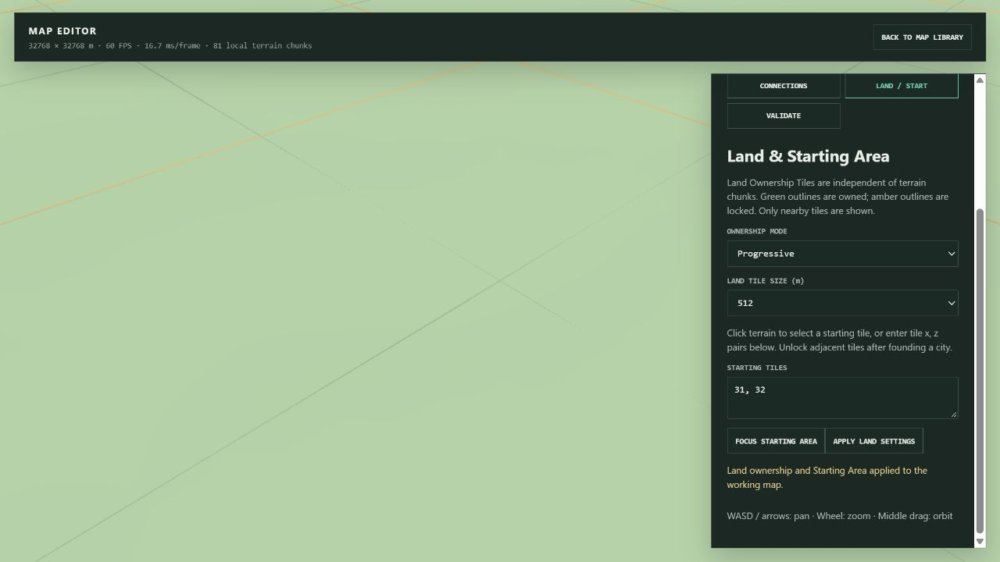
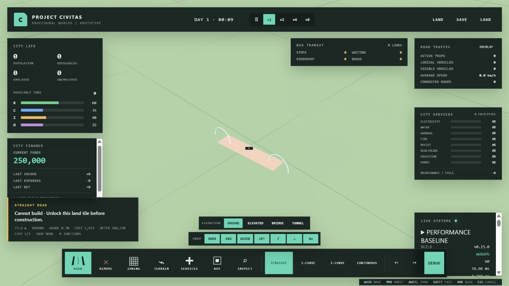
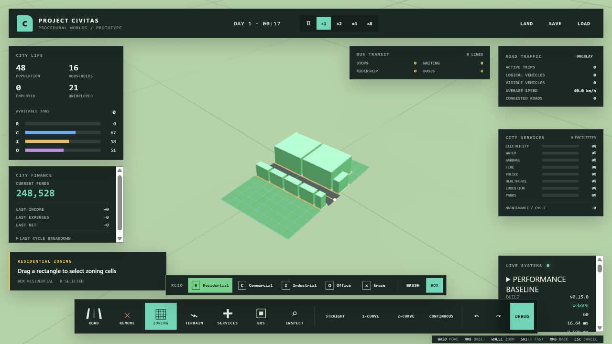
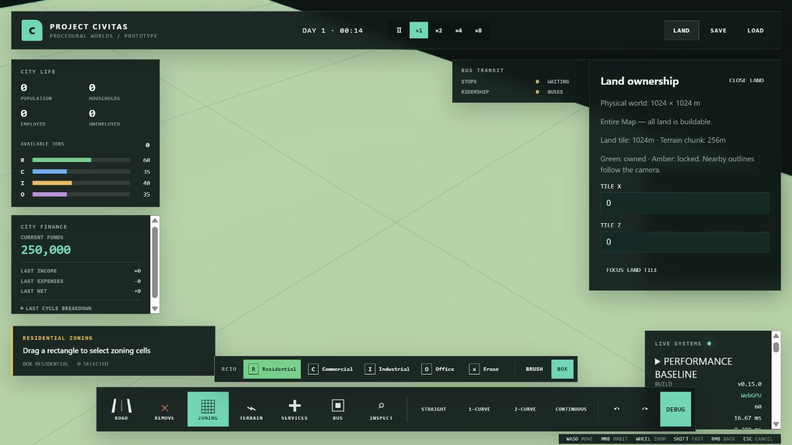
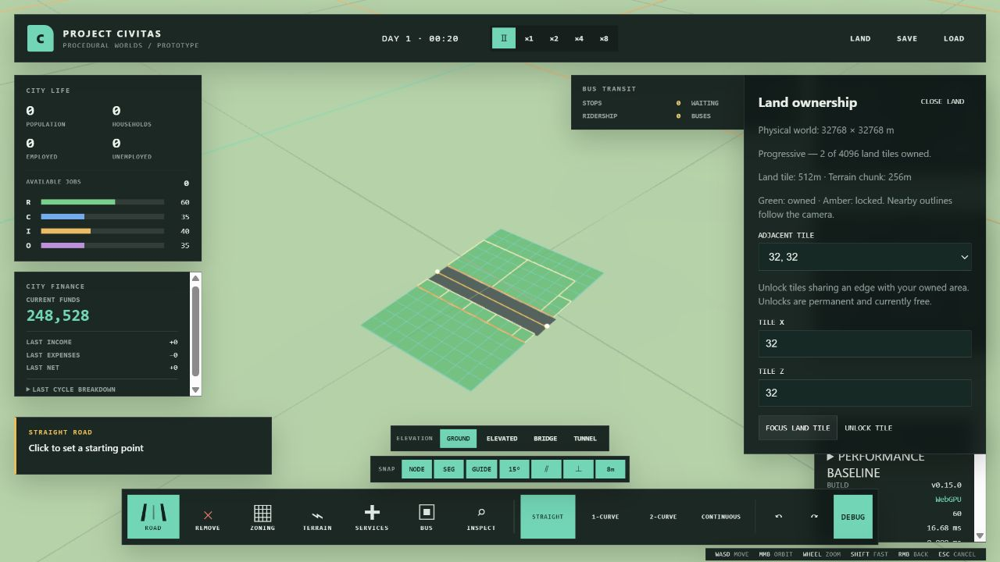

# PR #47 additional physical world / land ownership verification

## Gates and regression coverage

Final `npm test`: **37 files / 281 tests passed** (64.54s). The test configuration caps concurrent workers at two so large-world and 100k-citizen fixtures do not exhaust CPU/memory on high-core laptops; it changes neither assertions nor test timeouts. Earlier unconstrained local runs hit existing acute-triangle zoning / 6000-person crowd tests' 5-second deadlines; controlled runs passed, including the final ordinary command. `npm run build`: **passed**, retaining Vite's existing bundle-size warning.

- `landOwnership.test.ts`: complete polygon/path footprints, locked gaps, rendered bend joins, bounds and partial edge tiles, adjacent-only unlock, Worker roads/zoning/building lots/services, unchanged funds on rejected construction, sparse City save/reload, atomic corrupt-save rejection, Starting Area/City isolation, old v13/v12 Entire Map migration, 64km metadata.
- `worldSizing.test.ts`: all offered square/rectangular dimensions and spacing combinations, 16km/4m exclusion, actual 16km/32km generation/save/reload, bounded terrain buffers and local patches, no ordinary snapshot heightmap.
- `worldRendererReplacement.test.ts`: actual Babylon meshes and `updateSnapshot` gate dispose both in-range obsolete zones and out-of-world zone/debug caches on 32km→1km replacement.
- `mapAsset.test.ts`: real Worker editor/settings/export/storage/New Game plus City unlock persistence, alongside the existing asset/City isolation checks.
- Existing Individual Citizen, dense crowd, Traffic, Transit, terrain, water, service and performance suites pass.

## Actual browser checks

Windows / Chromium in-app browser / Babylon WebGPU / 1280×720. Development checks at `127.0.0.1:5173`; final Production Build checks at the separate `127.0.0.1:4175` origin. The original user quicksave at 5173 was loaded but not overwritten. No persisted user data was deleted.

| Check | Result |
| --- | --- |
| Existing 1km Save | Loaded as Entire Map; 7 road segments / 14 lanes / 2032 zone cells retained |
| New 1km Entire Map | Generated and saved a comparison City; subsequently loaded into the same runtime from a developed 32km city |
| New 4km Progressive | Generated / started with 1 of 16 ownership tiles; 1024m land tiles independent of 256m terrain chunks |
| 16km safe resolution | UI automatically chose 16m; 4m was absent, generation/editor/save succeeded; 1025×1025 samples |
| 32km safe resolution | UI automatically chose 32m; only 32m/64m options offered; generation/editor/save succeeded |
| Custom 32km Starting Area | Editor applied 512m land tiles and starting tile 31,32; focused and displayed nearby outlines |
| Map Asset persistence | Saved asset, reloaded page, selected persisted asset, founded city with only its configured starting tile |
| Progressive construction | Road in locked tile 32,32 rejected; 0 segments and funds 250000 remained. After adjacent unlock, same road succeeded: 1 segment / 2 lanes / 108 zone cells, funds 248528 |
| Progressive zoning | Box selected 108 residential cells; 8 lots / buildings generated inside unlocked land |
| Large→Small in-game LOAD | Developed 32km world with road, zones and debug overlays replaced by 1km Save; 0 road/zone/lot meshes remained from the old city |
| New Game ownership override | Same Progressive asset started in Entire Map; asset itself retained Progressive settings after page reload |
| 32km City persistence | Unlocked ownership and developed city state saved and reloaded through the browser City workflow |
| 64km | Metadata and validation tested at 64m spacing; browser generation is not offered or claimed |
| Console | 0 errors / 0 warnings on checked development and production pages |

Steady empty-map/editor readings were about 60 FPS / 16.7ms. Construction and camera-local mesh rebuilds temporarily reduced FPS into the 50s. Editors showed **81 local terrain meshes**, including on 16km/32km worlds; their physical terrain chunk counts are 4096/16384. The retained TERRAIN FRAME / EDIT MESH readings are occasional rebuild durations, not steady frame latency. These checks do not certify a densely populated 32km/64km city.

## Deterministic CPU measurements

`npm run benchmark:land`; seed `land-ownership-foundation`, Flat Plains, same local brush, recommended safe UI spacing. Raw artifact: [`benchmarks/land-ownership.json`](../../benchmarks/land-ownership.json). Node v22.23.2 / Windows / Intel Core Ultra 5 125H. Single CPU diagnostic sample, with development browser open; no statistical speedup claim. Renderer FPS above was measured separately.

| Metric | 1km | 4km | 16km | 32km |
| --- | ---: | ---: | ---: | ---: |
| Sample spacing m | 4 | 4 | 16 | 32 |
| Terrain grid | 257² | 1025² | 1025² | 1025² |
| Physical terrain chunks | 16 | 256 | 4096 | 16384 |
| Terrain bytes | 264196 | 4202500 | 4202500 | 4202500 |
| Ordinary snapshot height bytes | 0 | 0 | 0 | 0 |
| Entire Map owned entries stored | 0 | 0 | 0 | 0 |
| Progressive starting entries | 1 | 1 | 1 | 1 |
| Local dirty chunks | 4 | 4 | 4 | 4 |
| Local patch bytes | 67669 | 67669 | 4693 | 1365 |
| Generation ms | 103.60 | 653.45 | 719.38 | 600.75 |
| Initial load ms | 108.09 | 2268.61 | 1928.83 | 1792.37 |
| Local edit ms | 17.088 | 4.753 | 1.348 | 0.371 |
| 100 empty simulation ticks ms | 6.901 | 0.964 | 0.784 | 0.796 |
| City serialization ms | 14.54 | 179.77 | 172.27 | 170.10 |
| City reload ms | 58.82 | 948.41 | 1047.12 | 1175.21 |
| Empty City Save estimated bytes | 532395 | 8409003 | 8409003 | 8409003 |

Coarser resolution bounds the terrain buffer independently of physical area; local edits stay local and do not instantiate detailed simulation for every land tile. Explicit first load/save/export still copies the full bounded terrain buffer. Physical chunk descriptors remain metadata in full snapshots; ordinary clock/traffic updates do not send them. Existing #14 instrumentation and agent LOD/spatial-query behavior remain unchanged. Complete terrain streaming/LOD, populated large-city certification, origin rebasing, DEM parsing and land purchase economics are deferred.
