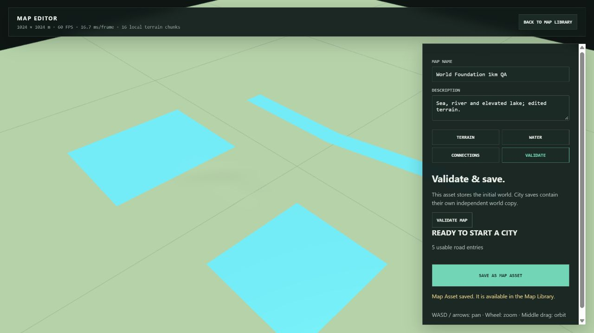
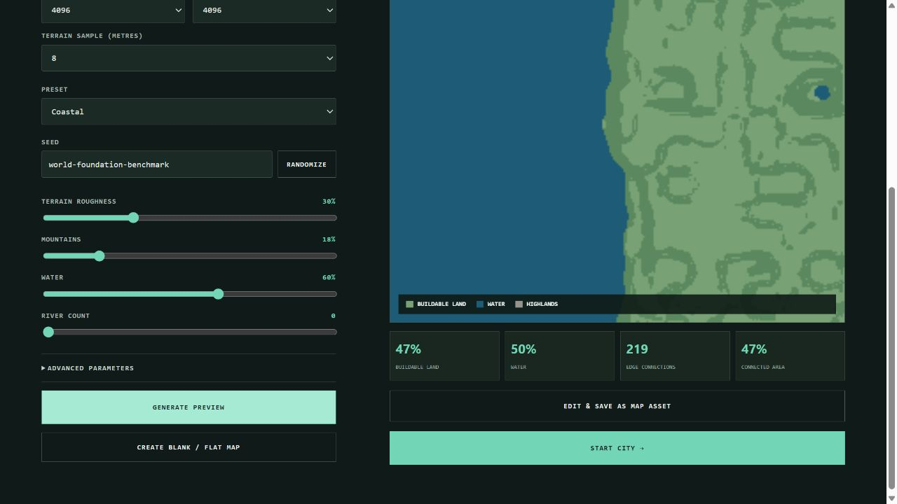
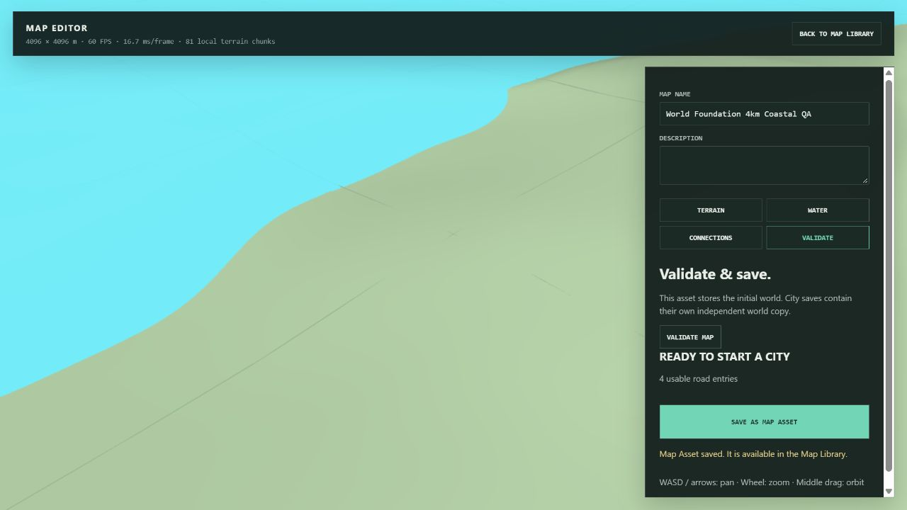
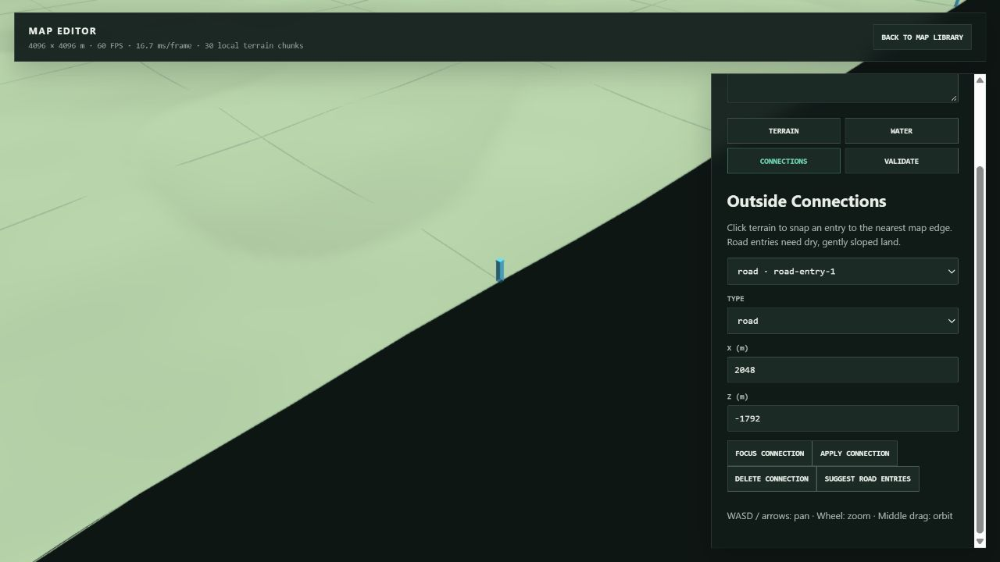
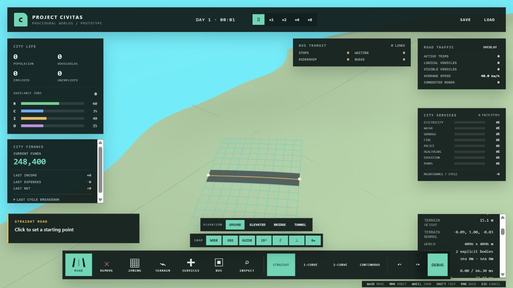

# World Foundation Pass verification

Verified on 2026-10-01, based on main `b0a689e`, branch `codex/world-foundation-pass`.

## Phase gates

| Phase | Test result | Production build |
| --- | --- | --- |
| 1 — shared metadata / v13 migration | 257 passed | passed |
| 2 — variable bounds / terrain / chunks | 260 passed | passed |
| 3 — explicit hydrography | 265 passed | passed |
| 4 — assets / editor / integration | 271 passed, 34 files | passed |

The build retains Vite's existing large-bundle warning. Browser console error/warning counts were both zero on the checked development and production pages.

Regression coverage includes 1km/4km generation and save/reload; 4096×1104m partial edge chunks; 8m sampling; edge roads and traffic outside links; invalid dimensions; old Save migration; local smoothing/patches; one-pass chunk grouping; polygon holes/river queries/narrow-water intersections; different water elevations; terrain-independent water; actual Babylon mesh retention; IndexedDB library round-trip/duplicate rejection/CRUD; independent developed City saves; and real Worker editor/load/export/New Game integration. Existing Individual Citizen, Traffic, Transit and performance suites remain passing.

## Actual browser checks

Codex in-app Chromium browser, 1280×720, Windows, Babylon WebGPU. Production verification used the built application at `127.0.0.1:4174`; existing Save verification used `127.0.0.1:5173`. The separate production origin kept the existing user's quicksave intact.

| Check | Result |
| --- | --- |
| New 1024m blank map, 4m spacing | Edited, validated, persisted, selected in Library, started New Game |
| Independent explicit waters | Sea 0m, River 8m (20m width), Lake 20m appeared together |
| Terrain raise/lower after water creation | Lake vertices and 20m elevation unchanged; explicit bodies retained |
| Outside editing | Added a dry road entry at x=-512, z=0; validation reported 5 usable entries |
| Existing 1024m City Save | Loaded legacy sea-level world with 7 road segments, 14 lanes and 2032 zone cells |
| Procedural 4096m coastal / 8m spacing | Previewed, edited, saved as an Asset; 513×513 samples, 256 chunks, 2 explicit bodies |
| Map Asset persistence | Reloaded production page, selected persisted 4km Asset and reopened Editor |
| Camera-local terrain | 81 terrain meshes at centre; focusing x=2048, z=-1792 reduced this to 30; no visible missing local terrain |
| New Game from saved 4km Asset | Started, constructed 1 road / 2 lanes / 120 zone cells; funds 248400 |
| New City Save / reload | Saved, reloaded page and loaded City; dimensions, road, clock (68s), funds and waters retained |
| Asset/City independence | Later changed Asset's first sea surface to 7m and saved it; existing City reloaded with both seas still at 0m |
| Console | 0 errors, 0 warnings on both pages |

Steady editor/city readings were approximately 60 FPS / 16.7ms. Initial visible terrain creation recorded about 69ms in the retained terrain-update metric; road construction about 56ms. These are occasional rebuild measurements, not steady-frame latency. This pass is not a certification of populated 8km/16km maps.

### Screenshots

## Deterministic CPU benchmark

`npm run benchmark:world`, seed `world-foundation-benchmark`, Coastal preset, 8m spacing and identical local brush/query inputs. Node v22.23.2, win32, Intel Core Ultra 5 125H. Raw artifact: [`benchmarks/world-foundation.json`](../../benchmarks/world-foundation.json). One sample on this computer, run alongside tests/build; timings are diagnostic and not a statistical cross-machine claim. The benchmark contains no Renderer; browser FPS above is a separate measurement.

| Metric | 1024m | 4096m |
| --- | ---: | ---: |
| Samples | 129×129 | 513×513 |
| Total chunks | 16 | 256 |
| Height buffer bytes | 66564 | 1052676 |
| Ordinary snapshot height bytes | 0 | 0 |
| Local patch bytes / dirty chunks | 17493 / 4 | 17493 / 4 |
| Map Asset JSON bytes | 138174 | 2116446 |
| Empty City Save JSON bytes | 141058 | 2119330 |
| Generation ms | 39.66 | 160.95 |
| Initial load ms | 16.17 | 146.27 |
| Local edit ms | 0.965 | 0.355 |
| 1000 water queries ms | 2.77 | 6.35 |
| City serialization ms | 2.42 | 30.11 |
| City reload ms | 4.90 | 75.80 |

Larger initial/export/save data scales with terrain samples. Ordinary snapshots carry no heightmap, and the same local edit produces the same patch size on both maps. Existing #14 instrumentation remains available. Browser's developed City Save was larger (~4910KiB) than this empty benchmark because it also contains generated roadside geometry; it is an explicit save operation, not an ordinary snapshot.
